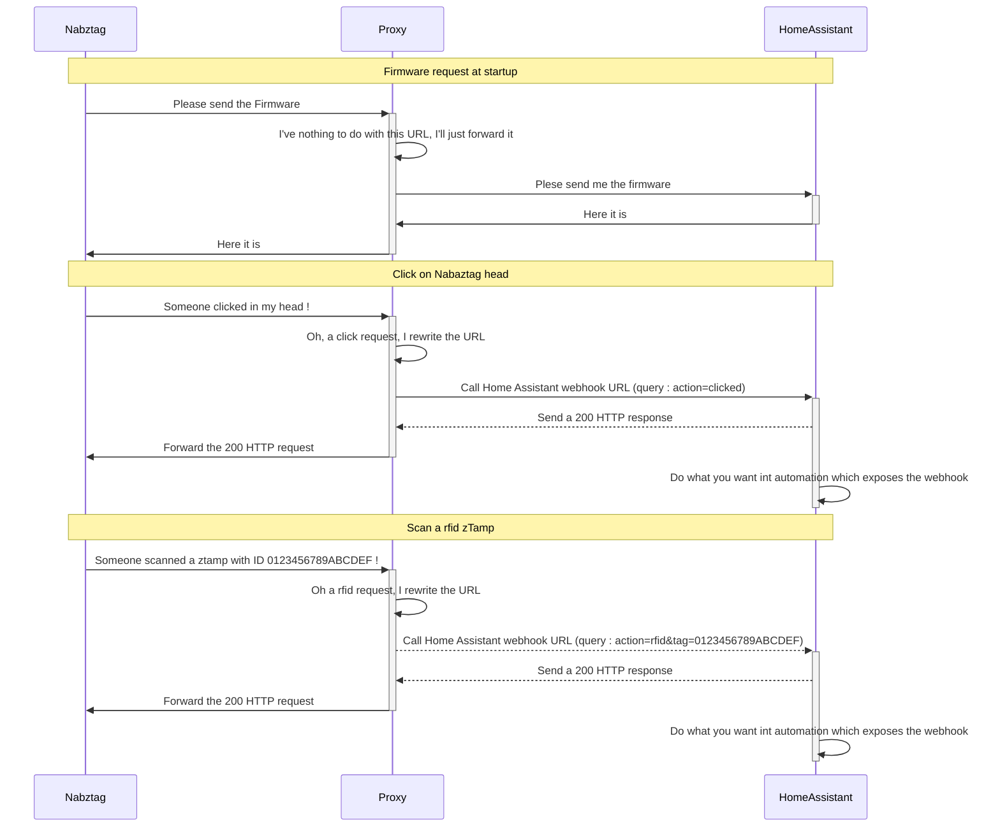

# nabaztag_haproxy_homeassistant
A Lua script to load in HAProxy as a proxy between a Nabaztag and Home Assistant

This post allow to command a Nabaztag:tag from Home assistant : [https://community.home-assistant.io/t/planning-to-revive-my-nabaztag-and-control-it-via-ha/38796](https://community.home-assistant.io/t/nabaztag-tag-the-smart-rabbit-is-back/41696). But it don't explain how to call Home Assistant from the Nabaztag.
Home Assistant can be configured to expose web hooks, but the URL format isn't compatible with the URL sent by the Nabaztag.

My two pences : a simple lua scrit to host in a HAProxy service which catch Nabaztag requests and rewrite them and forward the new ones to Home Assistant.
Implemented events : click, dblclick, rfid, ears
Not implemented events : record (long click on the button which allows to speach to the Nabaztag). It also requires a server to handle the file and convert speach to text. Should be feasible with Home Assistant but I haven't enough time to work on it.
I dit it with HAProxy because I already have one on my pfSense appliance, but it should be possible with any reverse proxy (nginx, etc.). I only tested in PfSense 2.7 (July 2023).

It uses : 
- the Nabaztag HomeAssistant package : https://github.com/pantomax/Home-AssistantConfig/blob/master/packages/nabaztag.yaml
- this Nabaztag serverless firmware : https://github.com/andreax79/ServerlessNabaztag

As explained in the post, the firmware must be hosted in the Home Assistant folder "/config/www". This requires to configure the Nabaztag and then all event sent by the Nabaztag will be send to the Home Assistant server.

## How to configure :
1. Configure the Nabaztag with the new firmware as explaned in the Nabaztag serverless github. The url MIUST be the HAProxy one, and not the Nabaztag one.
2. Configure HomeAssistant : create webhooks in Automations (note the webhook URL which will be requested for the 5.).
3. Create a new "LUA Script" file (in PfSEnse : Service -> HAproxy -> File). Choose the name you want for the file and past the content of the script.
4. You SHOULD create ACL in pfSense to enable the script only on required urls and avoid side effects.
5. Create a rewrite rule in HAproxy, wich call the lua script : lua-function: nabaztag_url_rewrite "/api/webhook/nabaztag".
    - The "nabaztag" in the path "/api/webhook/nabaztag" SHOULD be replaced by another string, depending of the webhook in HomeAssistant.

# Example of URLs rewrite by the LUA script
  Example 1 : Click
  - Original request sent by the Nabaztag : http://myhomeassistantinstance.fr/local/vl/hooks/click.php
  - rewritten URL : http://myhomeassistantinstance.fr/api/webhook/nabaztag?action=click
  Example 2 : Action on a ear of the rabbit
  - Original request sent by the Nabaztag : http://myhomeassistantinstance.fr/local/vl/hooks/ears.php
  - rewritten URL : http://myhomeassistantinstance.fr/api/webhook/nabaztag?action=ears&left=10&right=4
  Example 3 : Scan a ztamp
  - Original request sent by the Nabaztag : http://myhomeassistantinstance.fr/local/vl/hooks/rfid.php
  - rewritten URL : http://myhomeassistantinstance.fr/api/webhook/nabaztag?action=rfid&tag=0123456789ABCDEF

# Nota
- I discovered Lua with this script, don't hesitate to send pull request to improve it (and teach me)
- It seems Nabaztag can't use HTTPS. It works in HTTP.
- As no strong authentication is allowed by our old Nabaztag, please don't exposeson Internet neither the Nabaztag nor HomeAssistant web hook.
