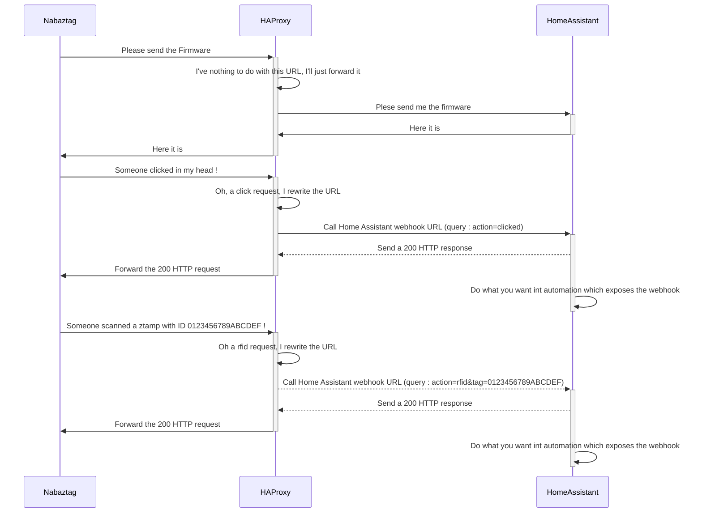

# nabaztag_haproxy_homeassistant
A Lua script to load in HAProxy as a proxy between a Nabaztag and Home Assistant

This post allow to command a Nabaztag:tag from Home assistant : [https://community.home-assistant.io/t/planning-to-revive-my-nabaztag-and-control-it-via-ha/38796](https://community.home-assistant.io/t/nabaztag-tag-the-smart-rabbit-is-back/41696)
It uses : 
- the Nabaztag HomeAssistant package : https://github.com/pantomax/Home-AssistantConfig/blob/master/packages/nabaztag.yaml
- this Nabaztag serverless firmware : https://github.com/andreax79/ServerlessNabaztag

As explained in the post, the firmware must be hosted in the Home Assistant folder www. This require to configure the Nabaztag and then all event sent by the Nabaztag will be send to the Home Assistant server.

Home Assistant can be configured to expose web hooks, but the URL format isn't compatible with the URL sent by the Nabaztag.

My two pences : a simple lua scrit to host in a HAProxy service which catch Nabaztag requests and rewrite them and forward the new ones to Home Assistant.
I dit it with HAProxy because I already have one on my pfSense appliance, but it should be possible with any reverse proxy (nginx, etc.). I only tested in PfSense 2.7 (July 2023).

## How to configure :
1 Create a new "LUA Script" file (in PfSEnse : Service -> HAproxy -> File). Choose the name you want for the file and past the content of the script
2 You SHOULD create ACL in pfSense to enable the script only on required urls
3 Create a rewrite rule in HAproxy, wich call the lua script : lua-function: nabaztag_url_rewrite "/api/webhook/nabaztag"
    - The "nabaztag" in the path "/api/webhook/nabaztag" SHOULD be replaced by another string, depending of the webhook in HomeAssistant. 
4 Configure HomeAssistant : create webhooks in Automations (for the webhook, use the same string as in the 3.)

# Example of URLs rewrite by the LUA script
  Example 1 : Click
  - Original request sent by the Nabaztag : http://myhomeassistantinstance.fr/local/vl/hooks/click.php
  - rewritten URL : http://myhomeassistantinstance.fr/api/webhook/nabaztag?action=click
  Example 2 : Action on a ear of the rabbit
  - Original request sent by the Nabaztag : http://myhomeassistantinstance.fr/local/vl/hooks/ears.php
  - rewritten URL : http://myhomeassistantinstance.fr/api/webhook/nabaztag?action=ears&left=10&right=4
  Example 3 : Scan a ztamp
  - Original request sent by the Nabaztag : http://myhomeassistantinstance.fr/local/vl/hooks/rfid.php
  - rewritten URL : http://myhomeassistantinstance.fr/api/webhook/nabaztag?action=rfid&tag=0123456789ABCDEF

# Nota
- I discovered Lua with this script, don't hesitate to send pull request to improve it (and teach me)
- 
